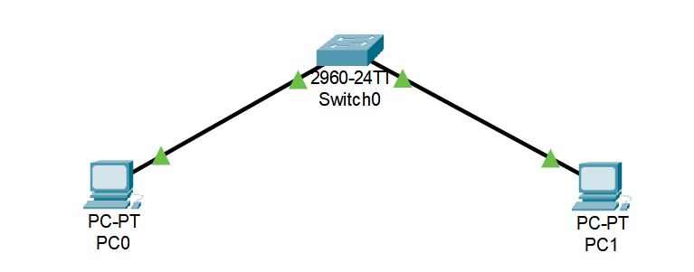
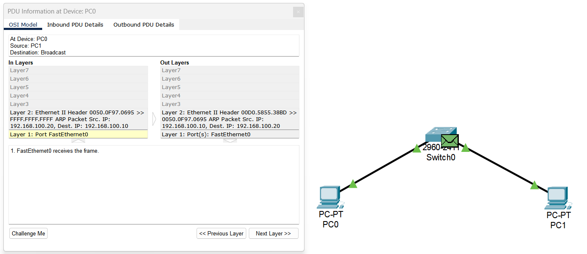
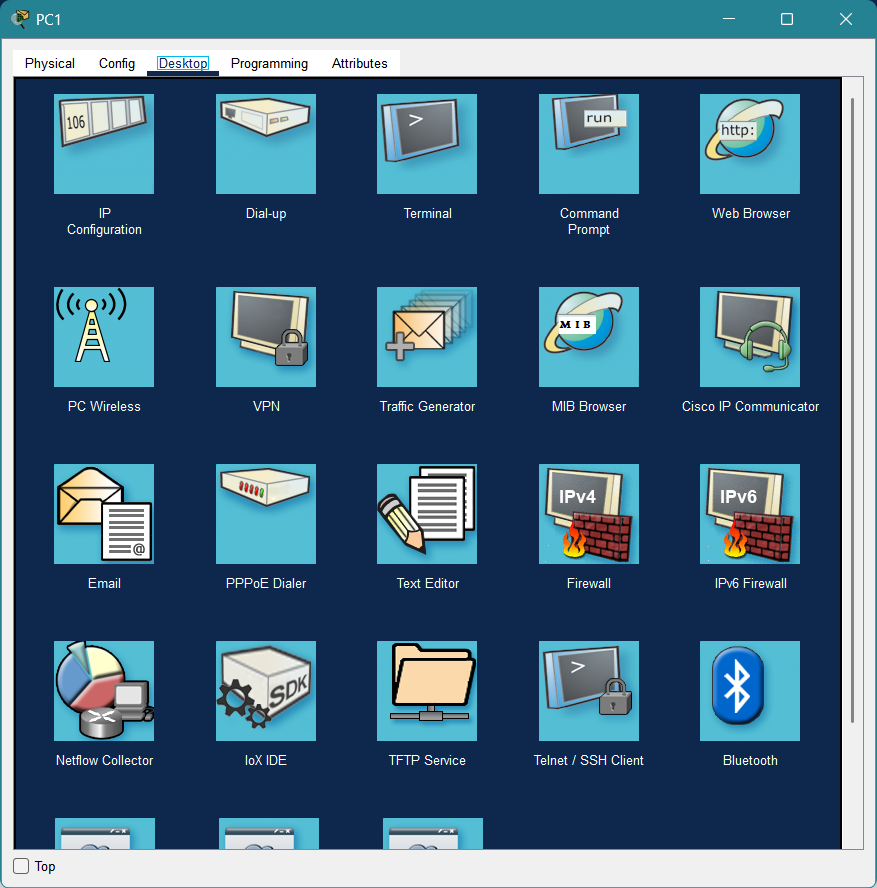
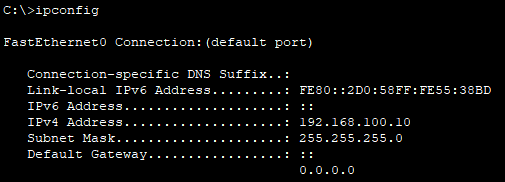

# [Project Name: Simulating Basic Switching and Analyzing Network Packets]

## Overview
This project involved simulating a small network encompassing two Windows PCs and one switch to comprehend the details of the ARP and ICMP protocols. The goal was to move beyond theoretical knowledge and observe how these core protocols actually contribute communication on a network

## 🎯 Learning Objectives
- Understand the ARP process and how MAC addresses are resolved from IP addresses.
- Examine the workings of the ICMP protocol and the Ping command.
- Learn basic Cisco switch configuration.
- Get familiar with simulating tools like Packet Tracer.

## 🛠️ Technologies & Tools Used
- **Simulator:** Cisco Packet Tracer
- **Protocols:** IPv4, ARP, ICMP
- **Analysis Tools:** Packet Tracer Simulation Mode

## 📸 Visual Documentation

### 1. Topology Diagram

*Caption: This diagram shows the overall network setup created in Packet Tracer.*

### 3. Traffic Analysis Output

*Caption: This screenshot from Packet Tracer's simulation mode shows the path of an ICMP packet (Ping) and the ARP table.*

## 🚀 Implementation Steps
1.  **Topology Design:** Placed two PCs and one Cisco switch in Packet Tracer.
2.  **IP Configuration:** 
After implementation step, now we are going to assign an IP address for both computers.
To achieve that, for instance we click on pc1 and then we see a window pops up (see the picture below).

Then we click on ***IP Configuraion*** section.

In order to assign an IP address, we type the address in *IPv4 Address* field. Because we do not have a massive network I decided to use Class C IP address. So I set 192.168.100.20 as its IP address and 255.255.255.0 as its subnetmask.

We do the same thing for pc0 but we set 192.168.100.10 as its IP address.

4. **Connection Check**
Now we are ready for checking connection between two computers.
Again we click on PC1 and click on *Command Prompt*. Then we wanna check if we set the IP address successfully. For that goal, we use ipconfig by typing `ipconfig` and hitting enter.

 

So things are Ok and we're about to just checking the connection.
We type `ping 192.168.100.10` and then we sould be able to see the result (See the pic below). Notice that the IP is related to PC0.

 

## 🔍 Key Findings & Results

- **ARP Discovery:** Observed that before the first ICMP packet, PC1 sent an ARP broadcast to discover PC0's MAC address
- **Protocol Dependency:** Confirmed that ICMP (ping) relies on ARP to resolve MAC addresses before communication can occur
- **Switch Operation:** Verified that the switch learns MAC addresses and forwards frames only to the appropriate port

## 🚧 Challenges & Solutions
- **Challenge:** Initially, Ping failed between the two devices.
- **Troubleshooting:** Upon checking the configurations, I realized the PCs were on different subnets (`192.168.1.10/24` and `192.168.2.10/24`).
- **Solution:** Corrected the IP address of one PC to place both on the same subnet. The issue was resolved.
- **Lesson Learned:** This challenge highlighted the critical importance of understanding subnet masks.

## 🗂️ Project Files
- `Switching_basic.pkt` (Packet Tracer file)
- `README.md` (This file)
