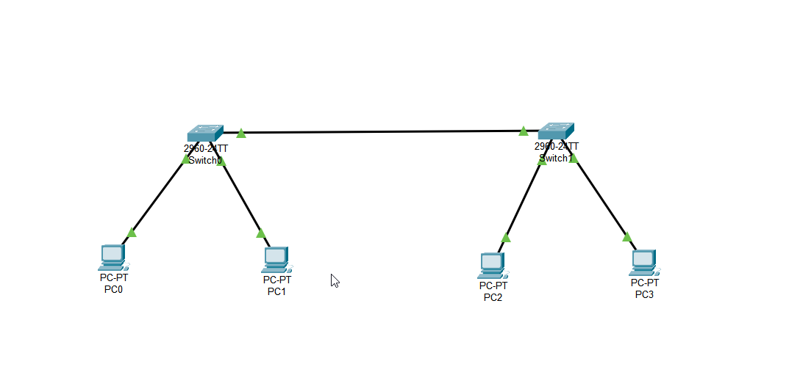

# [Project Name: Simulating and Trunking]

## Overview
In this project we figured out what vlans are and how they are different than subnets and how to implement them by simulating in Cisco Packet Tracer. We built a network including 2 switches and 2 vlans. We also had a comprehensive view about trunking. 

## 🎯 Learning Objectives
- Understanding vlans and trunking.
- Different modes of a switch interface.
- Learn basic Cisco switch configuration and commands.
- Get familiar with simulating tools like Packet Tracer.

## 🛠️ Technologies & Tools Used
- **Simulator:** Cisco Packet Tracer
- **Protocols:** IPv4, ARP, ICMP, 802.1q
- **Analysis Tools:** Packet Tracer Simulation Mode

## 📸 Visual Documentation

### 1. Topology Diagram

*Caption: This diagram shows the overall network setup created in Packet Tracer.*

## Project Concepts
### Vlan
Vlan stands for virtual lan. We utilize it to separate our networks logically. I will outline its usage by this example: Envision that we have a company network and within our network we have variant departments or sections (eg IT, Sales, Service , ...). It is not reasonable to have connections between different sections unless we have to. Typically we isolate those small networks by putting them in different vlans because PCs in a same vlan are only able to talk to each other. For instance in this project we set PC0 and PC2 to Sales vlan and PC1 and PC3 to IT vlan. Then we kind of shared our vlans between our switches by trunking.

###  **Pros and cons**
#### **Pros**  
- Enhanced Security 
- Traffic Segmentation
- Controlled Access
- Reduced Broadcast Domain
- Improved flexibility and Manageability 

#### **Cons**
- Configuration Complexity
- Higher Initial Cost
- Hardware Dependencies
- Troubleshooting Challenges
- Scalability and Performance

## 🚀 Implementation Steps
### 1.  **Topology Design:** Placed four PCs and two Cisco 2960 switches in Packet Tracer and two vlans named **IT** and **Sales**.

### 2.  **IP Configuration:** 
---
After implementation step, we assigned IP addresses to PCs. We talked about how to assign IP address in previous [project](../Project1_Basic_Switchig/README.md).
Here are the PCs and associated IP addresses table.

    | PC  |  Stich   |   Interface      |    IP address   | Vlan ID | Vlan name |
    |-----|----------|------------------|-----------------|---------|-----------|
    | PC0 | Switch 1 | Fastehternet 0/1 | 192.168.100.10  |   10    |  Sales    |
    | PC1 | Switch 1 | Fastehternet 0/2 | 192.168.200.10  |   20    |    IT     |
    | PC2 | Switch 2 | Fastehternet 0/1 | 192.168.100.20  |   10    |  Sales    |
    | PC3 | Switch 2 | Fastehternet 0/1 | 192.168.200.20  |   20    |    IT     |
 

### 3. **Vlan Creation**
---
Now that we are done with IP addresses, We'll go for creating vlans. Keep that in mind that by default all switch interfaces are in vlan 1. Let's check our vlan table by entering command **show vlan brief**.

Now let's move forward and create two vlans. One for Sales ans one for IT sections. In order to create our vlans we have to be in configuring mode.
We can create our vlan using **vlan (ID)** as shown bellow.
Notice that switches and computers only work with vlan IDs regardless of their names. To be more comfortable using vlans we assign them a name using **name (vlan name)** command.

As you can see in picture above, we gave 10 as its vlan ID and sales as its name as well. In order to create our IT vlan we enter the same commands but with different ID which is 20 and IT as its name.
We set the same configuration in another switch as well.  

### 4. **Adding Interface to Vlan** 
---
Again we need to be in configuration mode. We use commands depicted in picture bellow.
 

Lets talk about what each command does for us. 
**interface fastEthernet 0/1** is used to select the interface we want to adjust.  
**switchport mode access** sets the access mode for this interface. Notice that we always use access mode for interfaces connected to an end-system such as our PCs. 
**switchport access vlan 10** is utilized to add the selected interface to vlan 10; which is our sales vlan 
and in the end we enter **no shutdown** to either turn on the interface if it is off or prevent it from turning off. 
We again set those settings for vlan 2 but we change 10 to 20 as vlan ID and IT for its name. Let's check the vlan table again to see if our vlans are created.

 
*Vlan table * 

### 5. **Connecting switches vlans**
---
In this step we connect our switches to each other via gigabitEthernet interfaces for speed enhancement. We use  following commands to change interface mode from access to trunk. When we change interface mode to trunk, now it will add a tag to its frames that determines the vlan each frame has come from. 

 
 
We choose the interface by **interface gigabitEthernet 0/1** command. Then change interface mode to trunk using **switchout mode trunk**. Finally we enter **no shutdown** that I talked about earlier.

### 6. **Connection test between Vlans**
---
Before configuring our vlans, I had a ping test between PC0 and PC2 that are in a same subnet and vlan but different switches and you can see the result bellow.

 
 

As you can see, our test failed because we did not add the interface to the vlan. After adding the the interface to its vlan, the ping test was successful and we had connection between Sales PCs even with different switches and isolated from IT PCs.

 
*Successful ping on PC0*
 
 
We did the same ping test on PC2 to make sure that everything is working properly.

 
*Successful ping on PC2*
 
 
So, last but not least we accomplished our target and successfully connected two PCs on different Switches tooter.

## 🔍 Key Findings & Results
- **Trunk and Access Mode Discovery:** Understood the difference between Access mode and Trunk mode. 
- **Protocol Dependency:** Observed the 802.1q taq added to frames.
- **Switch Operation:** Verified that the switch learns Vlan ID  and forwards frames only to the appropriate clients.

## 🚧 Challenges & Solutions
- **Challenge:** Initially, Ping failed between the two devices. Wrong vlan ID configuration. 
- **Troubleshooting:** checked the vlan table to see what ports belong to what vlans.
- **Solution:** Corrected the vlan ID configured on an interface. Changing interface mode to trunk rather than access.
- **Lesson Learned:** This challenge highlighted the critical importance of understanding vlans and trunk mode.

## 🗂️ Project Files
- `Vlans and trunking.pkt` (Project2_Vlan and Trunking/Vlan and trunking .pkt) 
- `README.md` (This file)
