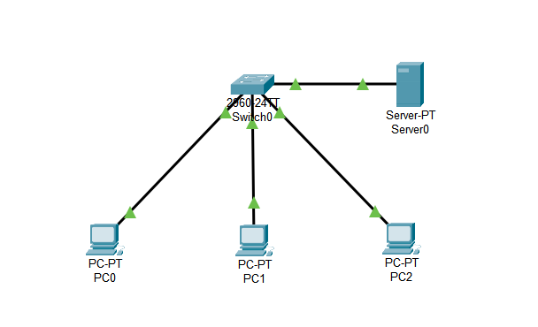
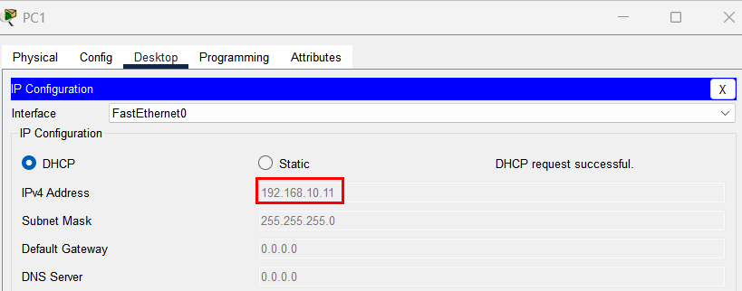
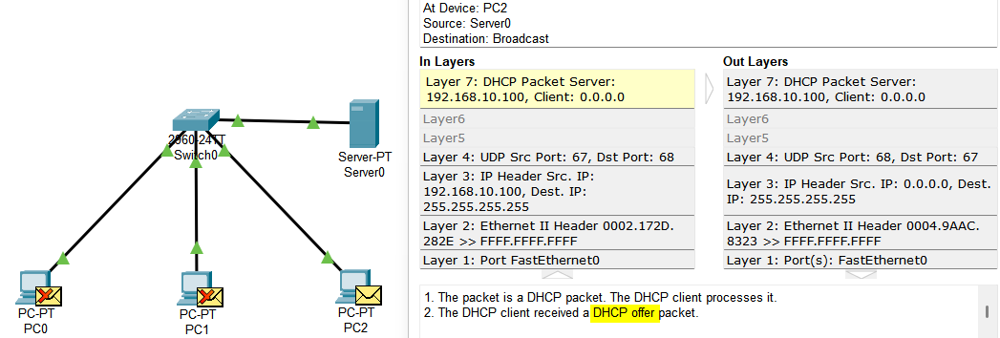
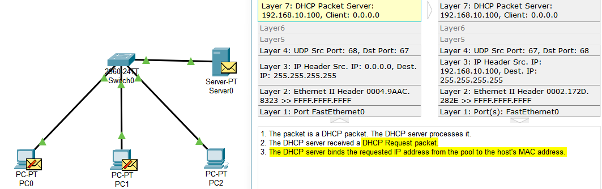
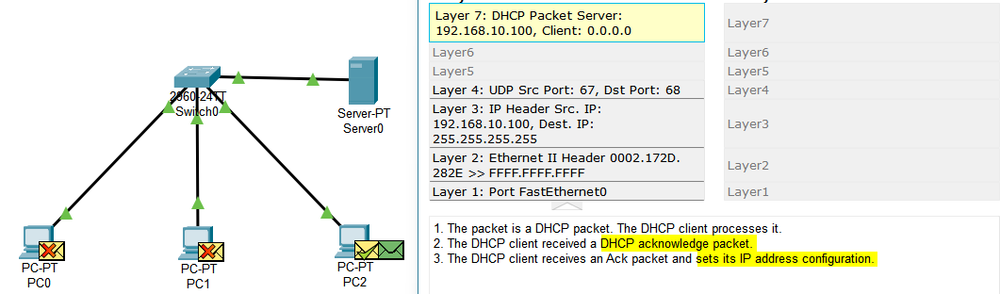

# [Project Name: Implementing DHCP server]

## Overview
In this project, we were introduced to what DHCP is, How it is essential in todays networks and learn how to implement it.
Also we analyzed the DORA process. 

## 🎯 Learning Objectives
- comprehending what DHCP is.
- Why DHCP is important and How to configure it.
- How DHCP assigns IP addresses to clients.
- Get familiar with simulating tools like Packet Tracer.

## 🛠️ Technologies & Tools Used
- **Simulator:** Cisco Packet Tracer
- **Protocols:** DHCP, IPv4, ARP, ICMP
- **Analysis Tools:** Packet Tracer Simulation Mode

## 📸 Visual Documentation

### 1. Topology Diagram

*Caption: This diagram shows the overall network setup created in Packet Tracer.*

## Project Concepts
### DHCP    
DHCP stands for Dynamic Host Configuration Protocol. As you can guess, this protocol is invented to dynamically configure clients information. Let me explain more; one example is that you see in previous projects, we assigned IP addresses manually and it was not efficient and most of the people do not know how to configure IP address on their computers. This is where DHCP comes in handy and is a real lifesaver. A DHCP assign IP addresses to client who requested for one automatically. SO we won't need to worry assigning about IP addresses in our network.
    
## 🚀 Implementation Steps
### 1.  **Topology Design:** Placed three PCs and one Cisco 2960 and a DHCP server in Packet Tracer

### 2.  **DHCP Configuration: ** 
---

#### Server IP:
Before we start we need to assign an IP address to our server manually. To do that, click on the server, go to desktop tab and IP configurations section.

So we have one server here that we want to utilize it as a DHCP server. Follow the configuration steps.
First, click on the server and open the **Services** tab.

Here you can see list of services, but for now we only want the DHCPv4 service. So click on it and lets dive into configuration.

#### Turn it on:
For the first step you need to turn on this service on the server. Do it

#### Pool name:
Second, You need to specify a pool name for you server. pool name is the name of the space of available IP addresses. 

#### Default gateway:
We covered default gateway in previous [Project](../Project3_Basic_Routing/README.md). Here we can set the IP address of our default gateway and then it will be configured automatically on the hosts.

#### DNS server:
And here we can set the IP of DNS server. We will cover the DNS server in close future.

#### Start IP address:
Here we are able to set the first IP address that from this address, server start to give the IP addresses to clients.

#### Subnet mask:
Subnet mask specify the Network ID from Host ID. In other words, it tell us that what our NetID is and how many host there can be in a network.

#### Maximum Number of Users:
We can set the number of users that can get and IP address from this server. For instance, I set the number to 10 meaning that at most maximum only 10 clients are able to get and IP address. 

#### Save it:
And in the end, click on the save button if you were altering a Pool that had already exist or click on add button if you want to add a new server pool name. 

## IP assigning
So lets see if any of our clients is able to get an IP address from the server or not.
For that, go to IP configuration on a PC and instead of choosing the static option, select DHCP.

well, we can see that our first job was successful. Now lets do it for PC1 as well.

It worked successfully for the second client too.

## DORA process:
Now lets see what actually happens when a client wants to get and IP address from the server. This process is DORA that stands for Discovery, Offer, Request, and Acknowledge. lets examine what is being happened.

### Discovery : 
When we choose to get an IP address from a DHCP server, our HOST like PC0 sends out a Discovery packet to discover the DHCP server.

As depicted in the picture, you can see. Since we do not have an IP address yet and we are not aware of what the server MAC address is, we sent out a broadcast packet.plus that, DHCP uses port 68 for client and port 67 for server.

### Offer:
Our DHCP server receives the Discover packet sent by client and response with offer packet. But before that, our server sends out an ARP packet to check whether the IP address that he wants to offer has been used by other clients or not. 

and as you can see, no answer was replied. It means that the address can be offered by DHCP and is not used by others. So the server sends out its offer.

 
In this packet, server offers an IP address from its pool and another configuration to the client. Notice that this packet is again a broadcast one.

### Request:
When the offer packet is received by the client, our PC now sends out a request packet and requests the configuration that the server sent it in offer package.

\

### Acknowledge:
As the final step of the DORA process, the server receives the request packet sent by the client, and matches the MAC address of the client with the new IP address that was assigned recently. Then, the server sends out an acknowledge packet to the client to grant final approval for the use of that IP address, completing the dynamic allocation process.

When the DORA process is accomplished, our client sends out an ARP packet called duplicate address detection to verify its IP address is unique and is not used by other clients.

## 🔍 Key Findings & Results
- **DHCP:** Getting familiar with DHCP server and how to implement it. 
- **DORA process** Analyzing DORA process steps .
- **The role of ARP in DHCP:** Comprehending the relevance of ARP packets and its connection with DHCP.

## 🚧 Challenges & Solutions
- **Challenge:** DHCP was not discoverd because of not having a static IP for its self. 
- **Troubleshooting:** checked the IP address to see whether we have set on or not.
- **Solution:** Set the static IP address for the server.
- **Lesson Learned:** This challenge highlighted that for our server we need to assign an IP to be discovered.

## 🗂️ Project Files
- [Getting familiar with DHCP](./Gettin%20familiar%20with%20DHCP.pkt)
- `README.md` (This file)
