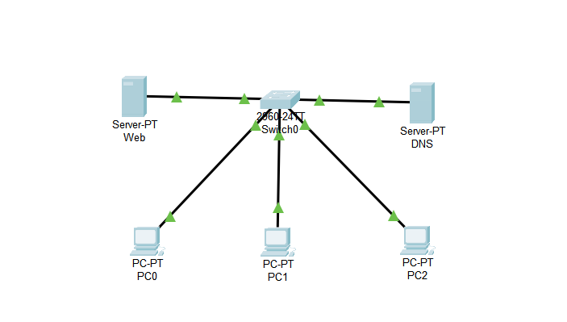

# [Project Name: Getting familiar with DNS and implementing DNS server]

## Overview
In this project, we explored the Domain Name System (DNS) and its essential role in modern networks. We then implemented and tested a DNS server using Cisco Packet Tracer to better understand how name resolution works in practice. For simplicity, DNS and DHCP services were configured on a single server.

## 🎯 Learning Objectives
- understanding what DHCP is.
- explaining DNS is important and How to configure it.
- Getting familiar with simulating tools like Packet Tracer.

## 🛠️ Technologies & Tools Used
- **Simulator:** Cisco Packet Tracer
- **Protocols:** DHCP, IPv4, ARP, DNS 
- **Analysis Tools:** Packet Tracer Simulation Mode

## 📸 Visual Documentation

### 1. Topology Diagram

*Caption: This diagram shows the overall network setup created in Packet Tracer.*

for simplicity we used DNS and DHCP services on one server.
## Project Concepts
### DNS    
DNS stands for Domain Name System. It is a system that resolves human-readable domain names into IP addresses. Since the internet works with IP addresses, DNS helps users access websites using names instead of numbers. For example, when you type youtube.com in your browser, DNS translates this name into an IP address so your device can connect to the correct server.

    
## 🚀 Implementation Steps
### 1.  **Topology Design:** Placed three PCs and one Cisco 2960 and DHCP, DNS and web servers in Packet Tracer

### 2. **Server Configuration**

#### Setting Server IP address :
First, a static IP address was assigned to the server to ensure it is always reachable by clients. Unlike dynamic addressing, a static IP prevents the server address from changing. To do that, click on the server, go to desktop tab and IP configurations section.

As illustrated in the picture above, **192.168.1.50** is set as the server IP address.

#### DNS configuration
The first thing we need to apply is to turn on the DNS service on the server.
Now, let's configure the first record.
Our aim is to associate our web server IP address to a URL which is **h.com** in this case. To do that, we set the following configuration. An A record was used to map the domain name h.com to the IPv4 address of the web server. A records are used for resolving domain names to IPv4 addresses.

As you can see, the IP address of webserver and the URL is set. Then press ok to save the new record.

## Testing :

So we added a new record and here is the time to check if we can connect to a webserver by the URL or not.
To achieve this, on a client, we go to **Desktop** tab and **Web browser** section.

Then we type the URL and press enter.

Yes. You can see that we successfully connected to the webserver.
## 🔍 Key Findings & Results
- **DHCP:** Getting familiar with DNS server and how to implement it. 
- **DNS** successfully resolved the domain name to the correct IP address.
- **Clients** were able to access the web server using a URL instead of an IP address.

## 🚧 Challenges & Solutions
- **Challenge:** Unable to connect to the web server using the domain name.
- **Troubleshooting:** Verified DNS records and tested name resolution using tools such as ping and nslookup.
- **Solution:** Added the DNS server IP address to the DHCP configuration.
- **Lesson Learned:** DHCP must provide the DNS server IP address to clients for proper name resolution.

## 🗂️ Project Files
- [Getting familiar with DNS](./Getting%20familar%20with%20DNS.pkt)
- `README.md` (This file)
